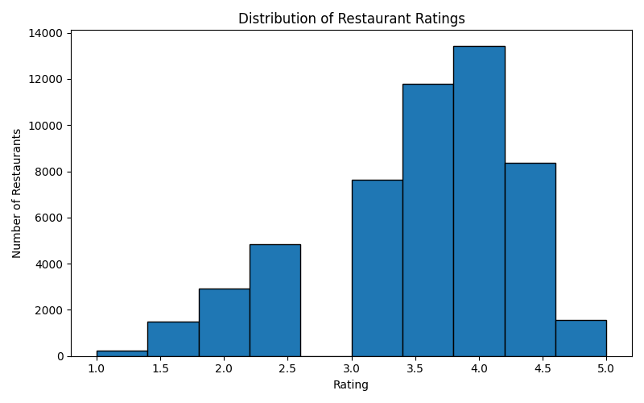
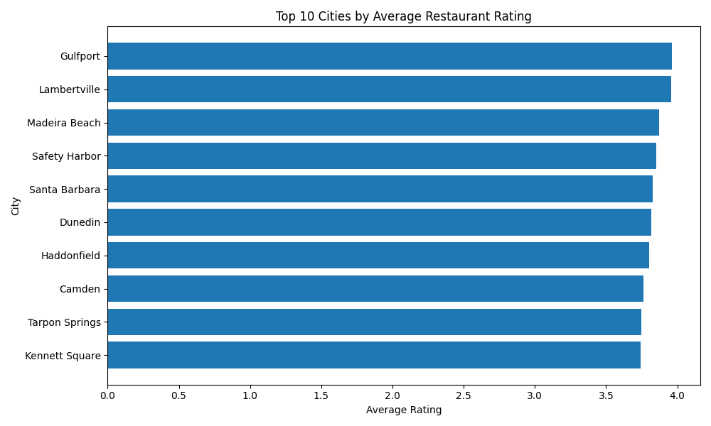
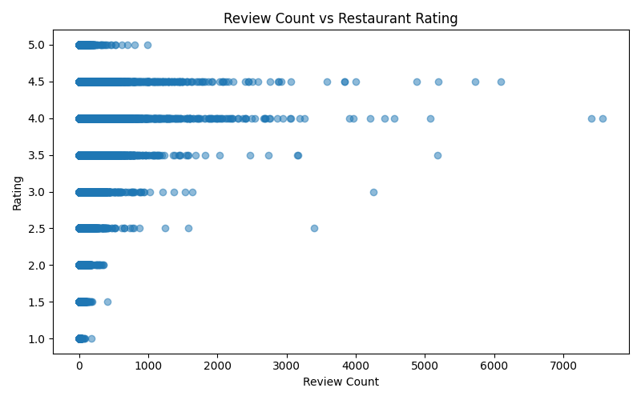
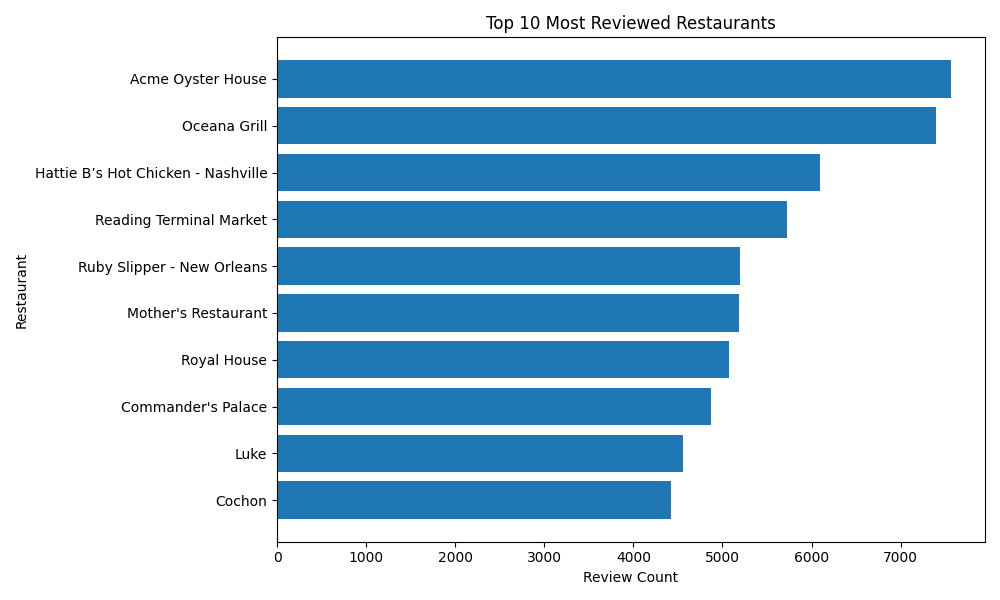

# 📊 Yelp Restaurant Analysis (SQL + Python Project)

## 📌 Objective
This project analyzes restaurant data from the Yelp Open Dataset to evaluate **rating reliability, customer engagement, and geographic performance**.

The analysis focuses on distinguishing between:
- **Perceived performance** (ratings)
- **True performance** (ratings + review volume)

using SQL and Python.

---

## 📥 Data Setup
The raw Yelp dataset is not included in this repository due to file size limitations and is ignored via `.gitignore`.

### To run this project locally
1. Download the Yelp Open Dataset
2. Extract the files
3. Place the following JSON files into:

```text
data/raw/
```

### Required files
- `yelp_academic_dataset_business.json`
- `yelp_academic_dataset_review.json`

### Example structure
```text
yelp-sql-analysis/
│
├── data/
│   ├── raw/
│   │   ├── yelp_academic_dataset_business.json
│   │   └── yelp_academic_dataset_review.json
│   ├── processed/
│   └── yelp.db
```

---

## 🛠️ Tech Stack
- **SQL (SQLite)** - joins, aggregations, filtering
- **Python (Pandas)** - JSON ingestion, preprocessing, transformation
- **Matplotlib** - data visualization
- **Visual Studio Code** - development environment

---

## 📂 Project Structure
```text
yelp-sql-analysis/
│
├── data/
│   ├── raw/                  # Yelp JSON files
│   ├── processed/            # cleaned CSV files
│   └── yelp.db               # SQLite database
│
├── scripts/
│   ├── convert_json_load_into_sql.py
│   └── create_visuals.py
│
├── sql_queries/
│   └── analysis_queries.sql
│
├── visuals/                  # generated charts
│
└── README.md
```

---

## ⚙️ How to Run
From the project root:

```bash
python scripts/convert_json_load_into_sql.py
python scripts/create_visuals.py
```

---

## ⚙️ Data Pipeline

### 1. Data Ingestion & Preprocessing
- Loaded raw Yelp JSON using `pandas.read_json(..., lines=True)`
- Filtered dataset to restaurant-related businesses only
- Selected relevant columns:
  - `business_id`
  - `name`
  - `city`
  - `state`
  - `stars`
  - `review_count`
  - `categories`
- Created a subset of reviews using chunked processing to handle large file size
- Exported cleaned datasets to CSV
- Loaded data into SQLite using `to_sql()`

### 2. Data Visualization
Generated key visualizations:
- Ratings distribution (histogram)
- Top cities by average rating (filtered)
- Review count vs rating (scatter plot)
- Most reviewed restaurants (bar chart)

All visuals are saved to the `/visuals` directory.

---

## 📊 Visualizations

### Ratings Distribution


### Top Cities by Rating


### Review Count vs Rating


### Most Reviewed Restaurants


---

## 🔍 Analytical Approach
The analysis is structured across three dimensions:
- **Rating behavior & reliability**
- **Geographic performance (city-level)**
- **Customer engagement (review volume)**

### Key SQL techniques
- `JOIN` operations across tables
- `GROUP BY` with aggregations (`AVG`, `COUNT`, `SUM`)
- `HAVING` filters for statistical significance
- Conditional aggregation (`CASE WHEN`)
- Multi-metric ranking

---

## ⭐ 1. Rating Behavior & Reliability

### Key Finding: High ratings are often associated with low review counts
Many top-rated restaurants have limited review volume, indicating **small-sample bias**.

### Key Finding: Ratings stabilize with increased review volume
Restaurants with more reviews tend to have more moderate but reliable ratings, reflecting broader customer feedback.

### Key Finding: "Trust Signal" = Rating + Volume
The most reliable top-performing restaurants are those that maintain:
- high ratings
- high review counts

This combination indicates consistent customer satisfaction over time.

### Additional Observations
- Category-level differences suggest cuisine-based rating patterns
- Perfect 5-star ratings are often not sustainable indicators of long-term performance

---

## 🌆 2. City-Level Performance

### Methodology
- Aggregated ratings at the city level
- Applied threshold filter: `HAVING COUNT(*) > 50` to ensure reliability

### Key Finding: Sample size impacts ranking validity
Cities with fewer restaurants tend to show inflated ratings due to limited observations.

### Key Finding: Engagement strengthens city-level reliability
Cities with both:
- high average ratings
- high total review volume

represent the most trustworthy high-performing markets.

### Key Finding: Rating distributions vary geographically
Using conditional aggregation revealed differences in:
- proportion of highly rated restaurants
- potential regional rating bias

### Additional Observations
- Larger cities show greater rating stability
- Smaller cities exhibit higher variability
- Evidence of a volume vs rating tradeoff

---

## 🏆 3. Review Volume & Popularity

### Key Finding: Review count is a proxy for demand
Restaurants with the highest number of reviews represent high-traffic and highly visible businesses.

### Key Finding: Popularity does not imply quality
Highly reviewed restaurants often have moderate ratings, demonstrating that visibility leads to more balanced evaluations.

### Key Finding: Best overall performers
Restaurants that maintain:
- high ratings
- high review counts

are the most reliable indicators of consistent performance.

---

## 📈 Key Takeaways
- Ratings alone are insufficient without context
- Review volume is critical for assessing data reliability
- Larger datasets produce more stable insights
- True top performers combine:
  - high ratings
  - high engagement

